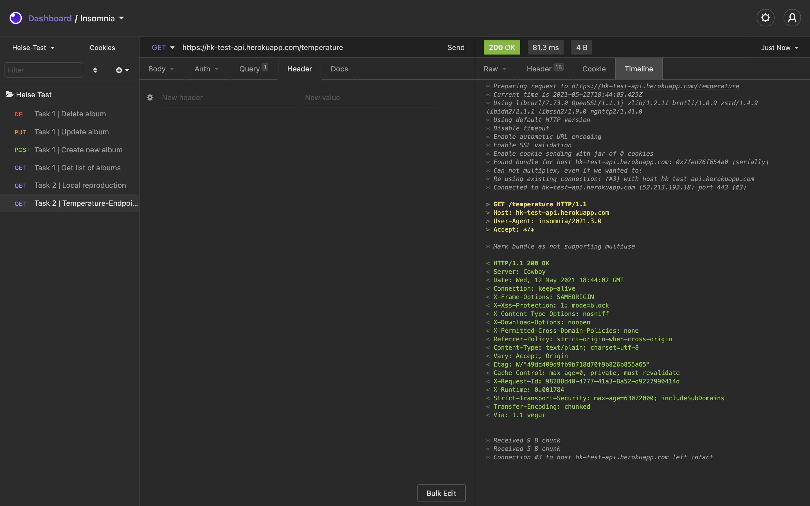
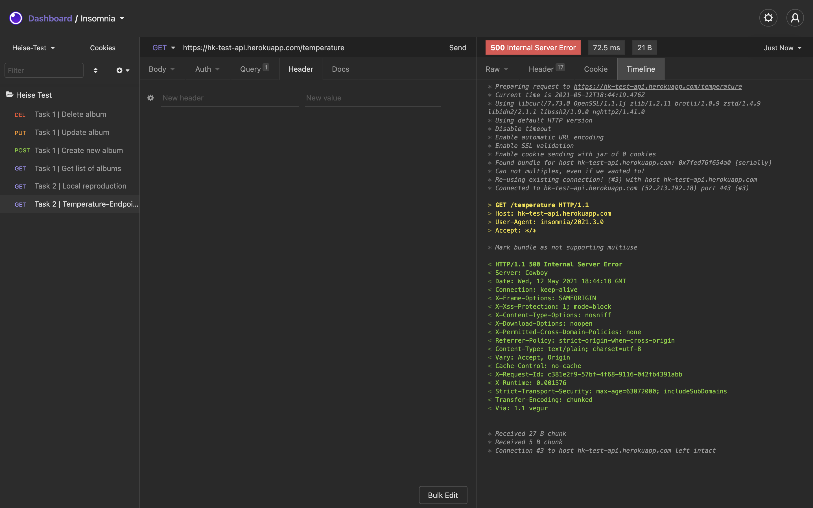

# Hk Test | Task 2 - Solution

## Problem description

The problem is, that the endpoint ```temperature``` is either returning the temperature ("13.5") or throwing an internal server error (HTTP-Statuscode: 500). So the api-endpoint is not reliable, because the response is changing intermittently between server error and success (HTTP-Statuscode 200).

### HTTP-Statuscode: 200


### Internal Server Error (HTTP-Statuscode: 500)


This response code indicates that the server encountered an unexpected condition that prevented it from fulfilling the request.

The server couldn't find any better response code - such as 501 Not Implemented, 502 Bad Gateway, (...) .

### Debugging

There are multiple ways to debug this problem:

1. Check the logs from heroku with ```heroku logs``` or logs in heroku-dashboard
2. If the app is not hosted on heroku (like in this case), check the `nginx` or `apache` logs, or also check the application-logfiles.

### Analysis of this case

This problem should be solvable without touching the codebase. That means this intermittent internal server error is e.g. not related to a script with bad performance or bad design.

There was a similiar case, which occured during the work on [aufgabe1](https://gitlab.christianratz.de/christian/hk-test-aufgabe-1). The endpoint `PUT https://hk-test-api.herokuapp.com/albums/:id` needs an `Accept`-header, such as `Accept: application/json` or `Accept: */*`, otherwise the api will through also an internal server error (HTTP-Statuscode `500`). The difference in this case is, that the server always returned an internal server error, as soon as there will be set an explicit header. 

In this case, for task2, the server returns intermittently an internal server error.

As far as i know heroku can easy handle higher loads of users, so it shouldn't be a problem with exceeded memory or overload of the infrastructure. Also it shouldn't be a problem with the underlying cowboy which is used from heroku as a http-server to provide all apps.

So it can't be a problem with apache or nginx and a fastcgi-timeout, because cowboy is used to serve all applications hosted on heroku.

The only reasons i can imagine or which came in mind, where issues with an unreliable mysql-server? Maybe the temperature will be read from a database. If an error such as [mysql server has gone away](https://dev.mysql.com/doc/refman/8.0/en/gone-away.html) occurs, the server will throw an internal server error. Another possible case could be if there is another service which is updating the temperature-entry in the database, so there will be a small timeframe of a lock during `INSERT`, and if in this timeframe someone requests the temperature from database, an internal server error will be thrown [deadlock](https://dev.mysql.com/doc/refman/8.0/en/innodb-deadlocks.html).
* solution: change configuration of the mysql-server, use a master(write)-slave(read)-configuration with two mysql-servers or for example a mysql-server (write) in combination with a redis-cache (read).

### Another application

I experienced or faced already issues with similiar behaviour with laravel, where the server randomly threw internal server errors, when requesting an endpoint. The solution was a misconfiguration / corrupt config-files.
* solution: fix the misconfiguration or use another framework

Besides it could be also a misconfiguration of apache or nginx. Also when the `fastcgi-process` exceeded and timeout. Other possible reason could be misconfiguration with apache and `mod_http2`.

* solution: fix the misconfiguration or use another http-server

The underlying infrastructure behind an application is simply overloaded or to weak, because of high user-load or exceeded memory. In this case users can also possibly face issues with intermittent internal server errors.
* solution: use a more powerful server or switch to another subscription or another server provider

